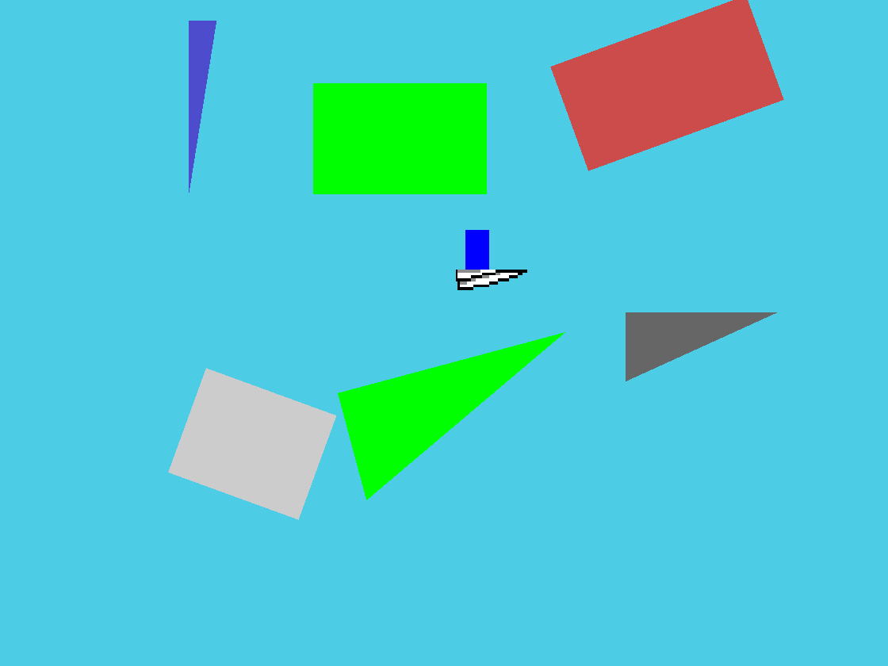
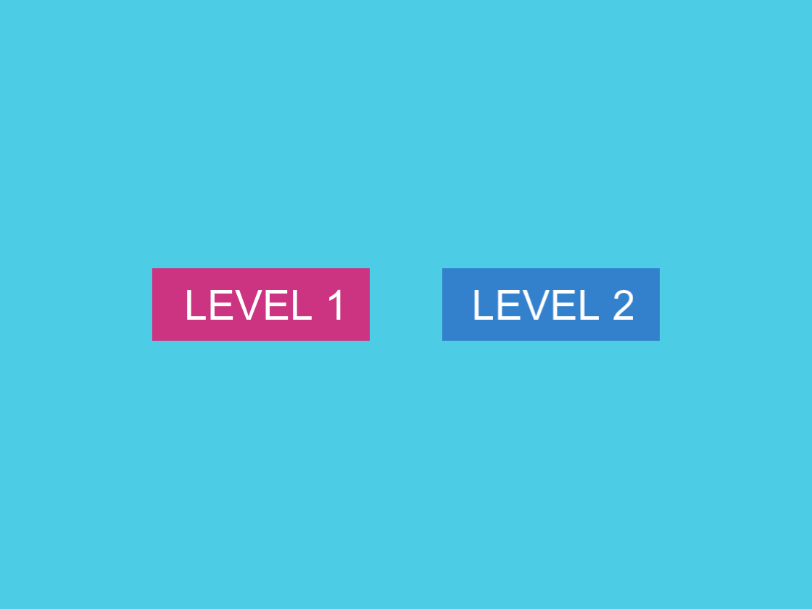

# Paper Rider
Paper Rider is a simple sidescroller game.

## WARNING
**This readme, as of now, is pretty outdated. It'll be updated when I reach a stable point in the development.**

## Mechanics
The main goal is to reach the end of the level by piloting a paper plane through various obstacles.

As of now there are 4 types of obstacles depending on what they collide with. These can be told apart because they have different colors:
- `red` if it can collide with everything.
- `white` if it does not collide with the plane.
- `cyan` if it does not collide with the rider.
- `dark-gray` if it does not collide with anything.

The rider, that pilots the paper plane, has the ability to jump off of it in order to dodge some specific obstacles, to then reattach to the plane simply by recolliding with it.

In a level some boost pads might be present, which can be used to make the plane regain speed.

## Game over condition
The level ends when the rider collides with either an obstacles or the ground.

The level is completed if the rider reacher the end of the level successfully.

## Level creation
As of now levels can be created in two ways:
- at runtime inside the code
- loading a custom map file

### Map file format
The extension should be `.prmap`.

The map file consists of a list of obstacles and a list of boost pads, in this order.

Before every list, the number of elements of that list has to be specified.

**ATTENTION**: Values such as `x`, `y`, `width`, `height` have to be used as if the window width and screen height were respectively `320` and `240`.
When the map is loaded, these values will get mapped to the actual width andheight of the window.

To describe an obstacle these fields have to be present:
- `collide_plane` (int): `0` if the obstacle does not collide with the plane, any other number otherwise.
- `collide_rider` (int): `0` if the obstacle does not collide with the rider, any other number otherwise.
- `triangle` (int): `0` if the obstacle is a triangle, any other number otherwise.
- `x` (float): X coordinate of the obstacle's position (upper-left corner).
- `y` (float): Y coordinate of the obstacle's position (upper-left corner).
- `width` (float): width of the obstacle.
- `height` (float): height of the obstacle.
- `rotation` (float): rotation of the obstacle relative to it's center (counter-clockwise).

To describe a boost pad these fiels have to be present:
- `triangle` (int): `0` if the boost pad is a triangle, any other number otherwise.
- `x` (float): X coordinate of the boost pad's position (upper-left corner).
- `y` (float): Y coordinate of the boost pad's position (upper-left corner).
- `width` (float): width of the boost pad.
- `height` (float): height of the boost pad.
- `rotation` (float): rotation of the boost pad relative to it's center (counter-clockwise).
- `boost_angle` (float): angle of the boost effect (could be different from the rotation).
- `boost_power` (float): power of the boost effect.

**N.B.**: New lines and spaces are treated the same way. Any additional spaces are trimmed.

#### Example of a map file
Here's an exaple of a map file:
```
4
1 0 1 5.125 7.5   10 62.5 0
1 1 0 140   10    75 40   20
0 1 0 3     140   50 40   -20
0 0 1 162.5 112.5 55 25   0
2
0 50   30  62.5 40 0  0  5
1 62.5 130 85   40 15 15 10
```
And this is the result:


## Screenshots
Current level selection menu:


Plane flying with particle system:


Rider jumping from the plane:


## Features to implement
- Sound system
- Improve the UI
- Map editor
- Power-ups/Portals
